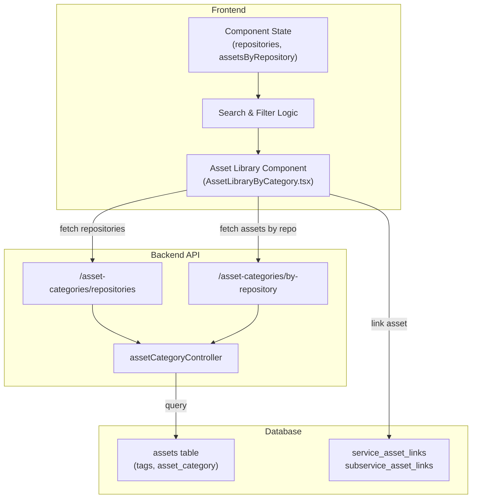

# Design Document: Asset Library Web Assets Linking

## Overview

This design document outlines the solution for fixing the Asset Library web assets linking issue. The problem is that web assets are not appearing in the Asset Library component despite existing in the system. The root cause is a mismatch between how web assets are tagged/categorized in the database and how the Asset Library component queries and filters them.

The solution involves:
1. Ensuring web assets are properly tagged with the "Web" repository value
2. Fixing the backend query to correctly retrieve web assets
3. Verifying the frontend component properly handles the asset data
4. Establishing a consistent linking mechanism between assets and services

## Architecture



## Components and Interfaces

### Frontend Component: AssetLibraryByCategory

**Location**: `frontend/components/AssetLibraryByCategory.tsx`

**Responsibilities**:
- Fetch and display repositories (Web, SEO, SMM)
- Fetch assets for each repository
- Filter assets by search query
- Display asset grid with linking capability
- Track linked assets and update counts

**Key State**:
```typescript
interface AssetLibraryCategoryState {
  repositories: string[];
  selectedRepository: string;
  assetsByRepository: Record<string, AssetLibraryItem[]>;
  loading: boolean;
  searchQuery: string;
}
```

**Key Methods**:
- `fetchRepositories()`: Fetch available repositories from backend
- `fetchAssetsByRepository(repo)`: Fetch assets for specific repository
- `filteredAssets`: Computed property that filters assets by search and repository
- `isAssetLinked(assetId)`: Check if asset is in linkedAssets prop
- `onToggle(asset)`: Handle asset linking/unlinking

### Backend Controller: assetCategoryController

**Location**: `backend/controllers/assetCategoryController.ts`

**Endpoints**:
- `GET /asset-categories/repositories` - Get all available repositories
- `GET /asset-categories/by-repository?repository=Web` - Get assets by repository

**Key Functions**:
- `getRepositories()`: Query distinct repository tags from assets table
- `getAssetsByRepository(repository)`: Query assets filtered by tags or asset_category

**Database Query**:
```sql
SELECT 
    id, asset_name as name, asset_type as type, asset_category,
    asset_format, content_type, tags as repository, status,
    created_at, updated_at, linked_service_id, linked_sub_service_id,
    web_thumbnail as thumbnail_url, web_url as url
FROM assets
WHERE (tags = ? OR asset_category = ?)
  AND status != 'inactive'
ORDER BY created_at DESC
```

### Data Models

**AssetLibraryItem Interface**:
```typescript
interface AssetLibraryItem {
  id: number;
  name: string;
  type: string;
  asset_category?: string;
  asset_format?: string;
  content_type?: string;
  repository: string;
  status?: string;
  workflow_stage?: string;
  qc_status?: string;
  thumbnail_url?: string;
  url?: string;
  linked_service_id?: number;
  linked_sub_service_id?: number;
  created_at?: string;
  updated_at?: string;
}
```

**Assets Table Schema** (relevant fields):
```sql
CREATE TABLE assets (
  id SERIAL PRIMARY KEY,
  asset_name VARCHAR(255),
  asset_type VARCHAR(100),
  asset_category VARCHAR(100),
  asset_format VARCHAR(50),
  content_type VARCHAR(100),
  tags TEXT,  -- JSON array or comma-separated (repository)
  status VARCHAR(50),
  web_thumbnail VARCHAR(1000),
  web_url VARCHAR(1000),
  linked_service_id INTEGER,
  linked_sub_service_id INTEGER,
  created_at TIMESTAMP,
  updated_at TIMESTAMP
)
```

## Data Models

### Asset Repository Classification

Assets are classified into repositories using one of two methods:

**Method 1: Tags Field**
- The `tags` field contains the repository value (Web, SEO, SMM)
- Stored as JSON array or comma-separated string
- Example: `["Web", "Blog"]` or `"Web"`

**Method 2: Asset Category Field**
- The `asset_category` field contains the repository value
- Used as fallback if tags field is empty
- Example: `"Web"`, `"SEO"`, `"SMM"`

**Query Logic**:
```sql
WHERE (tags = ? OR asset_category = ?)
```

This allows flexibility in how assets are tagged while ensuring they're discoverable.

### Asset Linking

Assets are linked to services/sub-services through dedicated linking tables:

**service_asset_links**:
```sql
CREATE TABLE service_asset_links (
  id SERIAL PRIMARY KEY,
  service_id INTEGER REFERENCES services(id),
  asset_id INTEGER REFERENCES assets(id),
  created_at TIMESTAMP
)
```

**subservice_asset_links**:
```sql
CREATE TABLE subservice_asset_links (
  id SERIAL PRIMARY KEY,
  sub_service_id INTEGER REFERENCES sub_services(id),
  asset_id INTEGER REFERENCES assets(id),
  created_at TIMESTAMP
)
```

## Correctness Properties

A property is a characteristic or behavior that should hold true across all valid executions of a system—essentially, a formal statement about what the system should do. Properties serve as the bridge between human-readable specifications and machine-verifiable correctness guarantees.

### Property 1: Repository Assets Consistency

**For any** repository name (Web, SEO, SMM) and any asset collection, querying the backend for assets in that repository should return only assets tagged with or categorized as that repository, and no assets from other repositories.

**Validates: Requirements 1.2, 2.2, 5.1, 6.1, 6.2, 6.5**

### Property 2: Asset Count Accuracy

**For any** set of assets in the system, the sum of assets in each repository should equal the total asset count minus unclassified assets, and the available count should equal total minus linked.

**Validates: Requirements 4.1, 4.2, 4.3, 4.4, 4.5**

### Property 3: Linked Asset Persistence

**For any** asset that is linked to a service or sub-service, querying the database after linking should return the link relationship, and the asset should display as "Linked" in the Asset Library on subsequent loads.

**Validates: Requirements 3.2, 3.3, 3.4, 3.5**

### Property 4: Search Filter Idempotence

**For any** search query applied to a filtered asset list, applying the same search query twice should produce identical results, and clearing the search should restore all assets for the selected repository.

**Validates: Requirements 8.1, 8.2, 8.3, 8.4**

### Property 5: Repository Filter Isolation

**For any** repository selection, the displayed assets should only include assets from that repository, and the available count should exactly match the number of displayed assets.

**Validates: Requirements 2.2, 2.3, 2.4, 2.5**

### Property 6: Asset Metadata Completeness

**For any** asset returned from the backend, all required metadata fields (id, name, type, repository, status) should be present and non-null, and the response should include thumbnail and URL fields when available.

**Validates: Requirements 1.3, 5.3, 6.3**

### Property 7: Active Asset Filtering

**For any** query to the backend for assets, only assets with status != 'inactive' should be returned, and inactive assets should never appear in the Asset Library regardless of repository selection.

**Validates: Requirements 5.2**

### Property 8: Asset Ordering Consistency

**For any** asset collection returned from the backend, assets should be ordered by creation date in descending order (newest first), and this ordering should be consistent across multiple queries.

**Validates: Requirements 5.4**

### Property 9: Component State Synchronization

**For any** change to linkedAssets props or repository selection, the component state should update correctly, and the UI should reflect the new state without requiring a page reload.

**Validates: Requirements 7.2, 7.3, 7.4, 7.5**

### Property 10: Unclassified Asset Handling

**For any** asset without a repository tag, the asset should not appear in repository-specific filters, but should appear when "All Categories" is selected.

**Validates: Requirements 6.4**

## Error Handling

### Backend Error Handling

**Missing Repository Parameter**:
- Status: 400 Bad Request
- Response: `{ error: 'Repository parameter is required' }`
- Trigger: GET /asset-categories/by-repository without repository query param

**Database Query Failure**:
- Status: 500 Internal Server Error
- Response: `{ error: 'Failed to fetch assets by repository' }`
- Trigger: Database connection error or query syntax error
- Action: Log error to console, return generic error message

**No Assets Found**:
- Status: 200 OK
- Response: `[]` (empty array)
- Trigger: Valid repository but no matching assets
- Frontend Handling: Display "No assets found in this category"

### Frontend Error Handling

**API Request Failure**:
- Catch: Network error or non-200 response
- Action: Log error, set loading to false, display error message
- Fallback: Set default repositories ['Web', 'SEO', 'SMM']

**Invalid Asset Data**:
- Catch: Missing required fields in asset object
- Action: Log warning, skip asset in rendering
- Fallback: Display placeholder with generic asset icon

**Linking Operation Failure**:
- Catch: Failed to update asset link in database
- Action: Show error toast notification
- Retry: Allow user to retry linking operation

## Testing Strategy

### Unit Tests

**Backend Tests** (`backend/controllers/__tests__/assetCategoryController.test.ts`):
1. Test `getRepositories()` returns distinct repository values
2. Test `getAssetsByRepository()` filters by tags field
3. Test `getAssetsByRepository()` filters by asset_category field
4. Test `getAssetsByRepository()` excludes inactive assets
5. Test `getAssetsByRepository()` returns correct metadata fields
6. Test error handling for missing repository parameter
7. Test error handling for database failures

**Frontend Tests** (`frontend/components/__tests__/AssetLibraryByCategory.test.tsx`):
1. Test component renders loading state
2. Test repositories are fetched and displayed
3. Test assets are fetched for each repository
4. Test repository tab filtering works correctly
5. Test search query filters assets
6. Test asset linking/unlinking updates state
7. Test linked asset count updates correctly
8. Test empty state displays when no assets found

### Property-Based Tests

**Property 1: Repository Assets Consistency**
- Generate random repository names and asset data
- Create assets with various tag combinations
- Query backend for each repository
- Verify returned assets match repository filter
- Minimum 100 iterations

**Property 2: Asset Count Accuracy**
- Generate random asset collections
- Distribute assets across repositories
- Calculate expected counts
- Query backend and verify counts match
- Minimum 100 iterations

**Property 3: Linked Asset Persistence**
- Generate random asset and service combinations
- Create links in database
- Query database for links
- Verify links persist and display correctly
- Minimum 100 iterations

**Property 4: Search Filter Idempotence**
- Generate random asset lists and search queries
- Apply search filter twice
- Verify results are identical
- Minimum 100 iterations

**Property 5: Repository Filter Isolation**
- Generate random asset collections
- Select each repository
- Verify only assets from that repository display
- Verify count matches displayed assets
- Minimum 100 iterations

**Property 6: Asset Metadata Completeness**
- Generate random assets
- Query backend
- Verify all required fields are present
- Verify no null values in required fields
- Minimum 100 iterations

### Integration Tests

1. End-to-end asset discovery flow
2. Asset linking across services
3. Search and filter combined operations
4. Asset count updates after linking/unlinking
5. Repository switching and data persistence

## Implementation Notes

### Key Fixes Required

1. **Ensure Web Assets Have Repository Tag**
   - Verify all web assets have `tags` field set to "Web" or similar
   - If not, update existing assets to include repository tag
   - Ensure new assets are tagged during creation

2. **Fix Backend Query Logic**
   - Current query uses OR condition: `WHERE tags = ? OR asset_category = ?`
   - This is correct but may need to handle JSON array parsing
   - Ensure tags field is properly indexed for performance

3. **Frontend State Management**
   - Ensure `assetsByRepository` is properly initialized
   - Verify assets are correctly stored by repository key
   - Ensure filtered assets computation is correct

4. **Linking Mechanism**
   - Implement proper asset linking to services/sub-services
   - Use dedicated linking tables (service_asset_links, subservice_asset_links)
   - Ensure links persist across page reloads

### Performance Considerations

- Add database index on `assets.tags` for faster queries
- Add database index on `assets.asset_category` for faster queries
- Implement pagination for large asset collections (future enhancement)
- Cache repository list in frontend state to reduce API calls

### Database Migrations

If needed, create migration to:
1. Ensure all web assets have proper repository tag
2. Add indexes on tags and asset_category fields
3. Verify linking tables exist and are properly configured

## Deployment Considerations

1. Verify database schema includes all required fields
2. Ensure backend API endpoints are accessible
3. Test asset retrieval with existing data
4. Verify linking tables are properly configured
5. Monitor API response times after deployment
